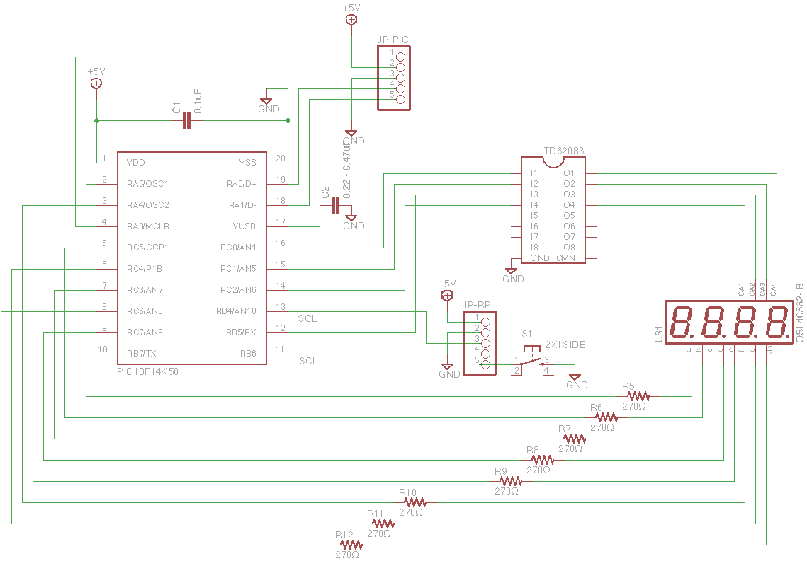
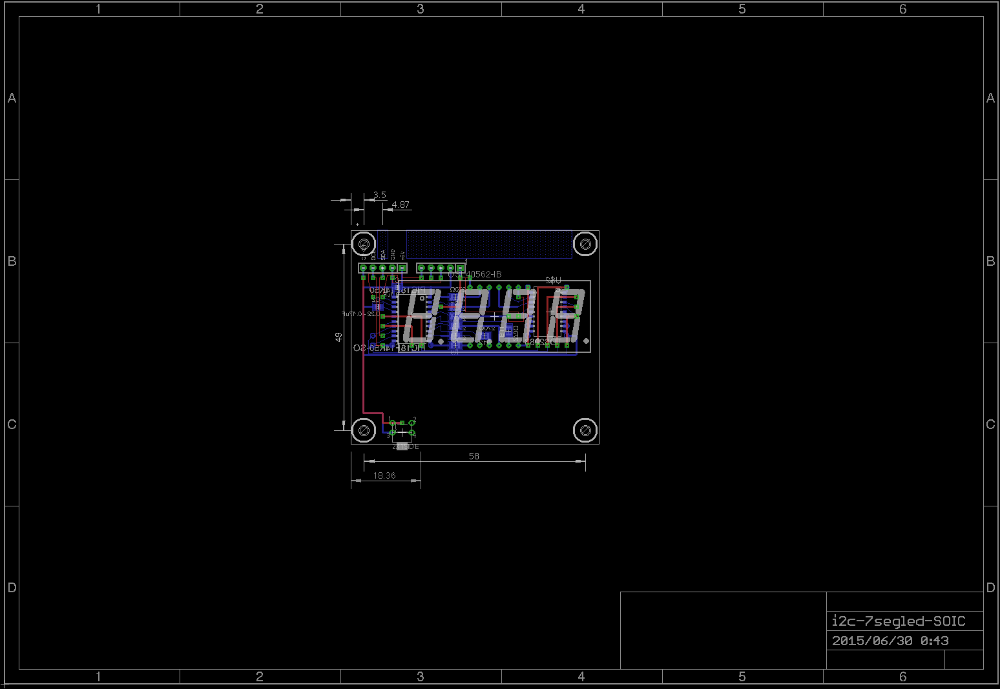

概要
====

- I2C を使用した7セグメントLED表示器です
- おもに Raspberry PI からの利用を想定してます  
 Raspberry PI からシェルコマンドを利用して直接制御可能
- 点滅、スクロール機能
- 最大で８つのページ切り替え機能


### パーツ

- PIC18F14K50 (SOIC)  
 1.25mm ピッチ

- TD62083 (SOIC)  
 1.25mm ピッチ

- ダイナミック接続４桁高輝度赤色７セグメントＬＥＤ表示器　カソードコモン　カソード共通接続  
 http://akizukidenshi.com/catalog/g/gI-03955/

- チップ抵抗  
 270Ω  1/4W x 8  

- チップコンデンサ  
 0.1uF  x2


### I2C通信仕様

- 通信速度 100kHz
- I2C スレーブ
- ライト要求 (Master -> Slaveへのライト要求) のみ

### コマンド

| address | data   | description |
|---------|--------|-------------|
| 0x00    | なし   | リセット    |
| 0x01    | なし   | LCD消灯     |
| 0x02    | 1..8   | 最大ページ数設定  |
| 0x03    | 0..255 | スクロール速度設定 (0.1秒 * (指定値+1)) *1  |
| 0x04    | 0..255 | ページ切り替え速度設定 (0.1秒 * (指定値+1))  |
| 0x05    | 0..255 | 点滅速度設定 (0.1秒 * (指定値+1))  |
| 0x06    | 0..1   | スクロール設定 (0:disable 1:enable)|
| 0x07    | 0..1   | 点滅設定 (0:disable 1:enable) |
| 0x10    | 0..7   | カレントページ設定 *2 |
| 0x11    | 文字列 | 描画文字列を指定、終端は 0x00 を指定します *3 |

*1 ... 文字のスクロール速度になります。例えば 19 を指定した場合 0.1*(19+1) で2秒単位にスクロールします。  
*2 ... 0 から数えるページ数を指定します。範囲は 0 から 最大ページ数-1 になります。  
*3 ... 描画文字列は ASCII コードで指定します。表示可能文字は数字、スペース、ハイフン、アンダースコア、パイプ、アルファベット（大文字、小文字）、ピリオドです。  


### 回路図



[EAGLE ファイル](./doc/eagle/i2c-7segled-SOIC.sch)

### ボード



[EAGLE ファイル](./doc/eagle/i2c-7segled-SOIC.brd)

### Unix シェルでの使用方法

shell ディレクトリにあるシェルコマンド利用することで簡単に LED を制御できます。

|コマンド              |引数  |説明                   |
|----------------------|------|-----------------------|
|7seg_clear            |なし  |7seg LCD をクリアします|
|7seg_enable_blink     |0..1  |点滅設定 (0:disable 1:enable)|
|7seg_enable_scroll    |0..1  |スクロール設定 (0:disable 1:enable)|
|7seg_puts             |文字列|描画文字列を指定|
|7seg_puts_from_stdin  |なし  |文字列を標準入力からリードして描画します。CTRL-C で中断するまで続けます。|
|7seg_reset            |なし  |リセット、内部変数ふくめ全て初期化します|
|7seg_set_blink_speed  |0..255| 点滅速度設定 (0.1秒 * (指定値+1))  |
|7seg_set_current_page |0..7  | カレントページ設定 |
|7seg_set_flip_speed   |0..255| ページ切り替え速度設定 (0.1秒 * (指定値+1))  |
|7seg_set_page_num     |1..8  | 最大ページ数設定  |
|7seg_set_scroll_speed |0..255| スクロール速度設定 (0.1秒 * (指定値+1))  |


例
```````````````````
cd shell
./7seg_reset
./7seg_enable_scroll 1
./7seg_set_scroll_speed 10
./7seg_puts "HELLO"
```````````````````


### 仕様


| 機能               | 仕様  |
|--------------------|--------------|
|インターフェース    |I2Cスレーブ   |
|I2Cスレーブアドレス|0x70         |
|I2C転送速度         |100kHz        |
|最大表示文字数      |終端NULL含めて200文字。複数ページの場合は各ページの終端NULL含めて合計で200文字|
|使用可能文字        |ASCII コードでスペース、ハイフン、アンダースコア、パイプ、アルファベット（大文字、小文字）、ピリオド|
|最大ページ数        |8ページ|
|表示機能            |ページ切り替え、文字スクロール、点滅、クリア|

